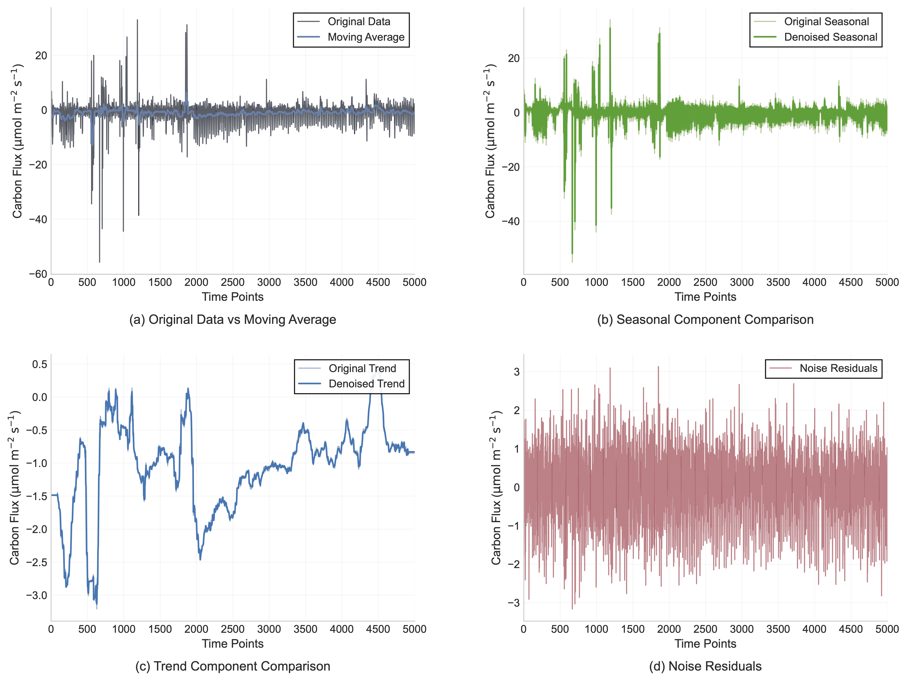
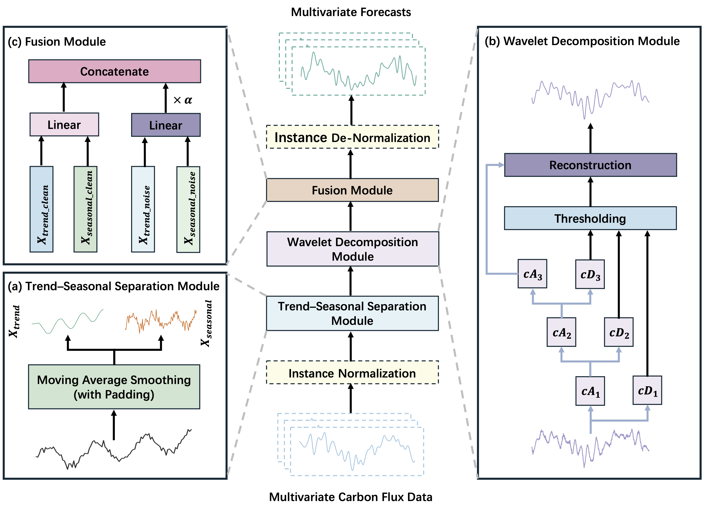

# CFNS

This repo is the official implementation for the paper: **Forecasting of carbon flux via noise seperation of time series data**.

## Introduction
CFNS (Carbon Flux Noise Separation) is a lightweight yet effective framework for multivariate carbon flux forecasting. It integrates reversible normalization, trend–seasonal decomposition, and wavelet-based denoising to separate meaningful temporal patterns from stochastic noise. By adaptively modeling key environmental variables such as temperature, humidity, radiation, and energy fluxes, CFNS captures both stable ecosystem dynamics and short-term fluctuations. Experiments on real-world eddy-covariance datasets show that CFNS achieves superior forecasting accuracy and robustness compared to recent deep learning and linear baselines. This repository provides the implementation of CFNS for reproducible research in carbon cycle modeling and environmental time series prediction.

<p align="center">

</p>

## Overall Architecture
The CFNS model adopts a structured pipeline for carbon flux forecasting. It first applies reversible normalization (RevIN) to stabilize input distributions and reduce nonstationarity in flux data. A trend–seasonal decomposition then separates the series into long-term trends and short-term variations. Each component is further refined through wavelet-based denoising, which isolates clean ecological signals from stochastic noise caused by turbulence and measurement uncertainty. Finally, an adaptive fusion module balances the contributions of clean and noisy components through a learnable weighting mechanism, enabling robust, accurate, and interpretable forecasting of multivariate carbon flux time series.

<p align="center">

</p>

## Usage 

1. Dataset can be obtained from [National Tibetan Plateau Data Center](https://data.tpdc.ac.cn/en/data/15281316-4024-4409-8c0f-f91e2f5b6574) or `/dataset/carbon_flux.csv`.

2. Install Python 3.8. For convenience, execute the following command.
    ```
    pip install -r requirements.txt
    ```
3. Install `pytorch_wavelets`.
    ```
    git clone https://github.com/fbcotter/pytorch_wavelets

    cd pytorch_wavelets

    pip install .
    ```
4. Train and evaluate model. We provide the experiment scripts under the folder ./scripts/. You can reproduce the experiment results as the following examples:

    ```
    bash ./scripts/CFNS.sh
    ```

## Main Results
CFNS was evaluated on multiple real-world eddy-covariance carbon flux datasets containing variables such as carbon flux, temperature, humidity, radiation, and energy fluxes. Experimental results show that CFNS consistently outperforms state-of-the-art baseline models, including both deep learning and linear architectures, across various forecasting horizons (96–720 hours). The model achieves lower MSE and MAE while maintaining high computational efficiency. By effectively separating clean ecological signals from stochastic noise, CFNS delivers robust and interpretable long-term forecasts, demonstrating strong potential for large-scale carbon cycle modeling and ecosystem monitoring applications.


<p align="center">

</p>


<p align="center">

</p>


<p align="center">

</p>


## Acknowledgement
We appreciate the following GitHub repos a lot for their valuable code and efforts.

Time-Series-Library (https://github.com/thuml/Time-Series-Library)
